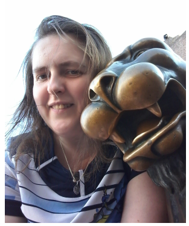

# Меня зовут Максимова Екатерина

Я работаю в Отделе маркетинга и рекламы в Сортавальской центральной библиотеке.

___Мне нравится разрушать стереотипы___

Для меня библиотекарь – это творческая профессия, которая приносит очевидную пользу. 
Она предполагает, что за один день я могу исполнить несколько интересных ролей, иногда совсем не похожих друг на друга.

**ЭТО:**
- **сотрудник, помогающий в поиске книг** или регистрирующий нового читателя в базе данных, 
- **актер** в образе сказочного персонажа на детском празднике, 
- **фотограф**, фиксирующий событие в стенах библиотеки,
- **SMM-щик**, пишущий заметку о нем на сайте учреждения и в социальной сети. 
- **web-дизайнер**, редактирующийhtml-код, чтобы создать новый online-ресурс из текстовых разработок и электронных презентаций коллег. 

>Последнее, пожалуй, самое любимое.

>Когда в 2008-году я почти случайно попала на курсы по основам web-дизайна, моим большим личным открытием стало то, что из странных символов html-изнанки можно создать нечто КРАСИВОЕ и ПОЛЕЗНОЕ. Для меня это – воплощение волшебства.

___Первый сайт Сортавальской библиотеки был написан мною в 2008 году «с нуля» в программе «Блокнот».___

> Сейчас он находится на профессиональном хостинге, я являюсь его главным администратором. 
> За эти годы ресурс сменил несколько платформ и каждый раз работы, связанные с виртуальным «переездом» выполняла я.

___Одной из моих постоянных задач является перенос offline-разработок коллег в виртуальную среду. Поэтому можно сказать, 
что [сайт Сортавальской центральной библиотеки](https://sortlib.karelia.pro/) – это моё портфолио.___ 

Хочу обратить ваше внимание на разделы [«Ресурсы»](https://sortlib.karelia.pro/resursi/), [«Книги»](https://sortlib.karelia.pro/knigi/) и [«Краеведение»](https://sortlib.karelia.pro/o_biblioteke/struktura_biblioteki/kraevedcheskii_centr/), поскольку здесь сосредоточены все online-продукты, 
созданные мною за время работы в этом учреждении.

Моя особая гордость - [тест-игра по роману А.С.Пушкина «Евгений Онегин»](https://sortlib.karelia.pro/resursi/tvorchestvo_aleksandra_sergeevicha_pushkina/igra_po_evgeniyu_oneginu), так как её авторство целиком принадлежит мне.

___В то же время я осознаю, что даже несмотря на постоянное самообразование, для воплощения многих моих идей у меня недостаточно знаний. Мне не хватает системности. Поэтому я пришла в Нетологию.___
